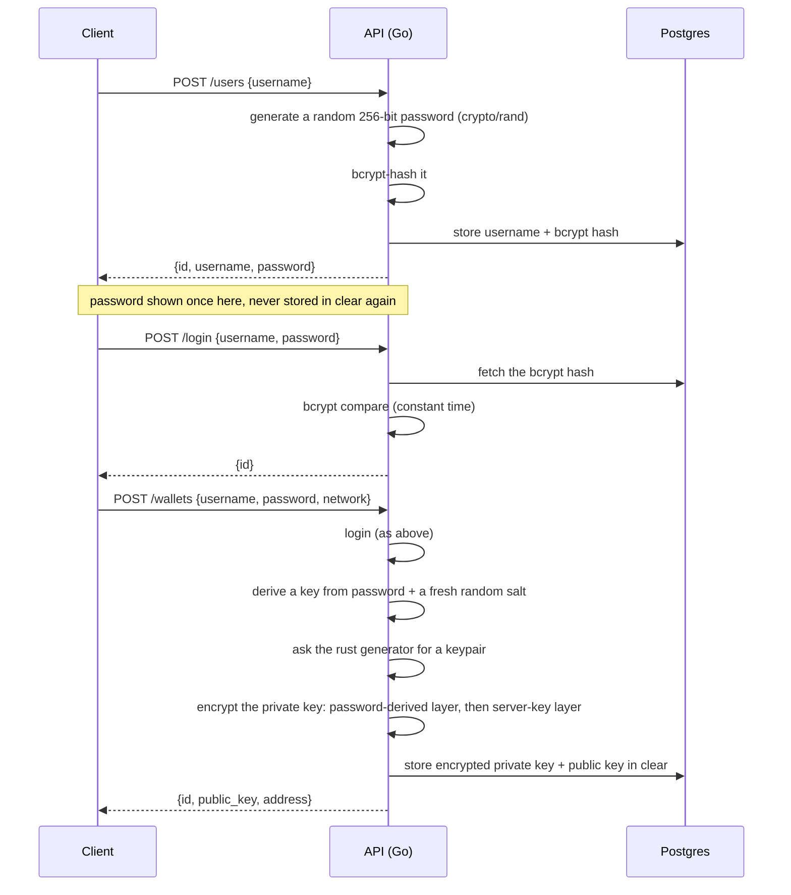

The password is never chosen by a human: it is generated server-side, 256 bits of `crypto/rand`, so brute-forcing it is not a realistic attack. Only its bcrypt hash is stored — one-way, so the server itself cannot recompute the wallet-encryption key without the client sending the password again on each request. See [entropy.md](entropy.md) for how the key material itself is generated, and [database-rbac.md](database-rbac.md) for who can read what in Postgres.
