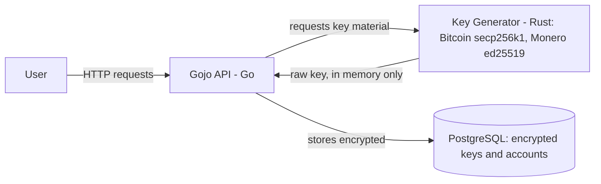

```mermaid
flowchart LR

User[User]

API[Gojo API - Go]

Generator[Key Generator - Rust: Bitcoin secp256k1, Monero ed25519]

DB[(PostgreSQL: encrypted keys and accounts)]

User -->|HTTP requests| API

API -->|requests key material| Generator

Generator -->|raw key, in memory only| API

API -->|stores encrypted| DB
```
