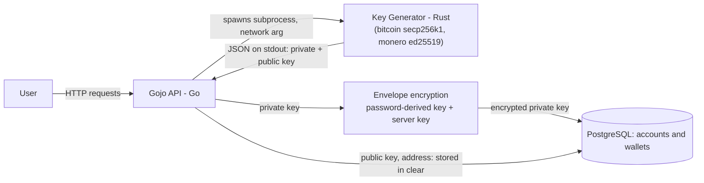

Public keys and addresses are meant to be shared, so they are stored in clear. Private keys never are: they go through two layers first, one derived from the account's password (see [api.md](api.md)), one keyed by a secret only the server holds — see [database-rbac.md](database-rbac.md) for who can read what in Postgres, and [entropy.md](entropy.md) for how the generator produces key material in the first place.
