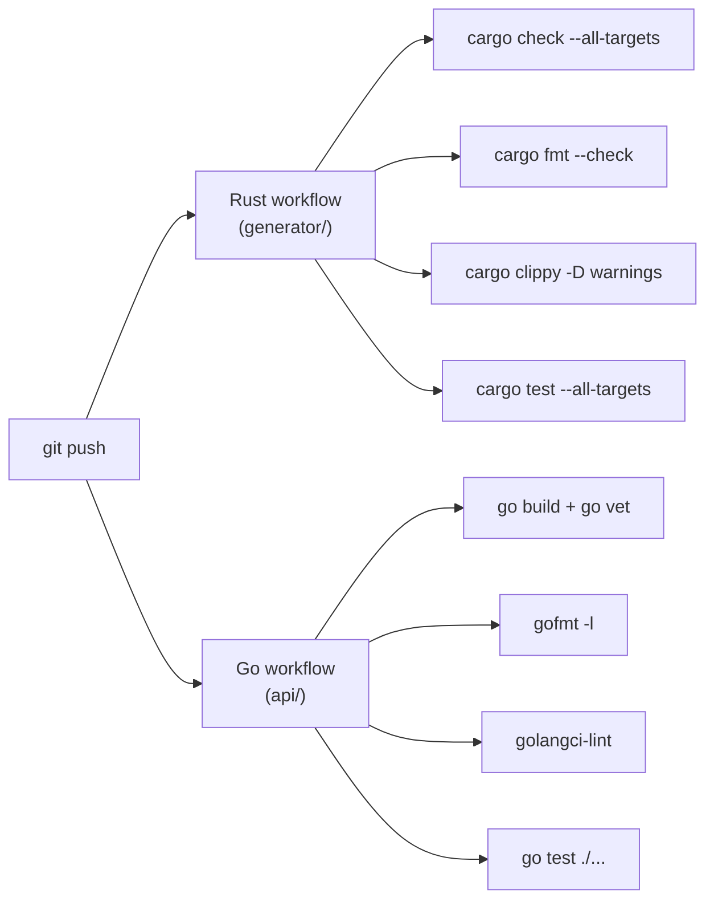

Two independent workflows, one per codebase, both triggered on every push. Within each, the four jobs run in parallel and any single failure fails the workflow. A new push to the same branch cancels whatever run is still in progress for it (`concurrency: cancel-in-progress`), so only the latest commit's result matters.

See [.github/workflows/rust.yml](../../.github/workflows/rust.yml) and [.github/workflows/go.yml](../../.github/workflows/go.yml) for the actual job definitions.
