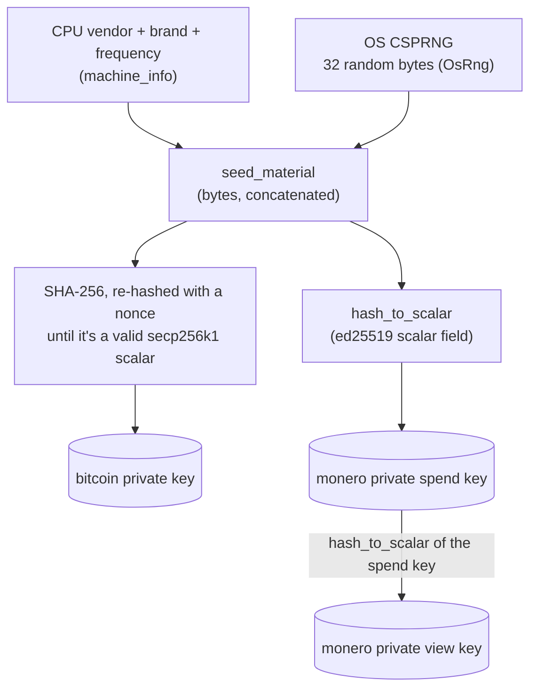

Two independent sources feed every key: a hardware fingerprint (CPU vendor/brand/frequency) and the OS's own secure random generator. Neither is trusted alone — the point is to not depend on a single RNG path, [as coldcard learned the hard way](../../README.md).

Diagnostics (cpu status, memory, cores) go to stderr; only the generated key material is printed as JSON on stdout (see `generator/src/main.rs`).
