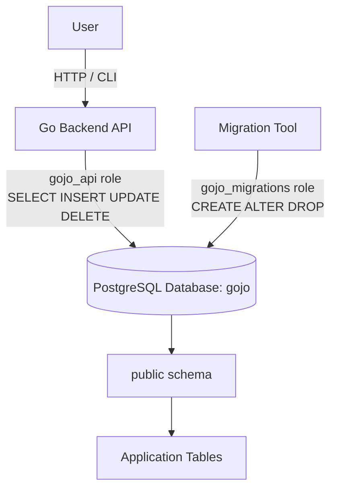

```mermaid
flowchart TD

User[User]

API[Go Backend API]

Migration[Migration Tool]

DB[(PostgreSQL Database: gojo)]

Schema[public schema]

Tables[Application Tables]


User -->|HTTP / CLI| API

API -->|gojo_api role\nSELECT INSERT UPDATE DELETE| DB

Migration -->|gojo_migrations role\nCREATE ALTER DROP| DB

DB --> Schema

Schema --> Tables
```
